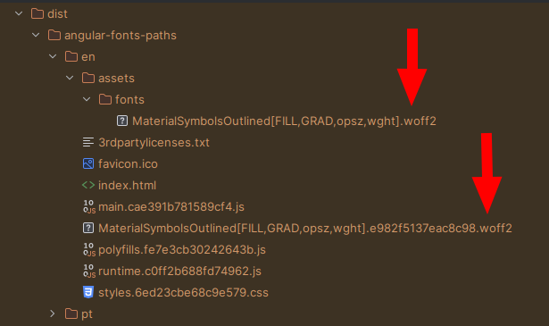

# AngularFontsPaths

This repository purpose is to reproduce the **duplication of fonts** files that happens in the angular build process.

This project was generated with [Angular CLI](https://github.com/angular/angular-cli) version 16.2.0.

## The problem

Two copies of the same font are appearing in the `dist` directory after the build:
One, located in the the `assets/fonts` folder, other in the root of `dist` (actually, as this projects is using i18n, at the root of each language folder):

 

The one at the "root" have a random string attached before the `.woff2`. It is only generated when the font is imported in the `styles.scss` file.

Besides the **increase in size** of the build output, one thing that is not working is to **preload fonts** in the `src/index.html` file. Using `href="assets/fonts/font.woff2"` in a `<link rel="preload">` tag will make the browser download this font, not use it, and download the version imported in the bundled CSS file in the root. 

## Steps to reproduce it
The setting to reproduce it:

1. Have a font inside `src/assets/fonts/font.woff2`;
2. Import it in a `@font-face` in the format `src: url('assets/fonts/font.woff2')` in the `src/styles.scss` file;  
3. Build the project using `ng build` command;

## Possible workarounds

### Absolute path in the @font-face rule
Turn `src: url('assets/fonts/font.woff2')` into `src: url('/assets/fonts/font.woff2')`. This does remove the duplicate in the root of `dist` directory but it **does not work in i18n projects**. The browser will look at `yourdomain.com/assets/fonts..` and not `yourdomain.com/en/assets/fonts..` resulting in a not found error.

## Build

Run `ng build --localize` to build the project. The build artifacts will be stored in the `dist/` directory.
